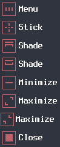

# flat-two-color
This is an Xfwm4 theme I made to go along with the Fantome GTK theme.

To install, navigate to your .themes folder inside your home folder with a terminal, and use git:

```git clone https://github.com/fakedeltatime/flat-two-color.git```

Or then just download it into the .themes folder with the download button.

# Screenshots



